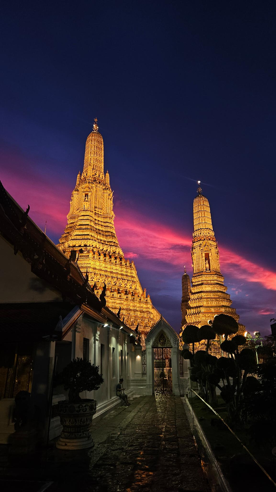

# Welcome!

Hi! My name is Arghya and I'm a Master's student at Columbia University Mailman School of Public Health. My interests include data science, geography, environmental health, statistics, and applied sciences. I am passionate about using technology for social good.

Outside of school, I spend my time learning and teaching Kathak (a classical Indian dance form), rollerblading,
collecting maps, reading, painting, caring for houseplants, traveling, and hanging out with friends and family.

To learn more about my background, visit the [About](about.html) page.

# Picture Gallery (Population: 1)

Here's a picture I took earlier this year when my best friend and I visited the Wat Arun Ratchawararam Ratchawaramahawihan temple in Bangkok, Thailand.




```{r build_site, include = FALSE, eval = FALSE}
# This chunk builds my site because RStudio freezes whenever I try to do it via the GUI
c("index.Rmd", "about.Rmd", "dashboard_landing.Rmd") |> 
  map(rmarkdown::render)
rmarkdown::render("dashboard_view.Rmd", output_format = "flexdashboard::flex_dashboard")

```

